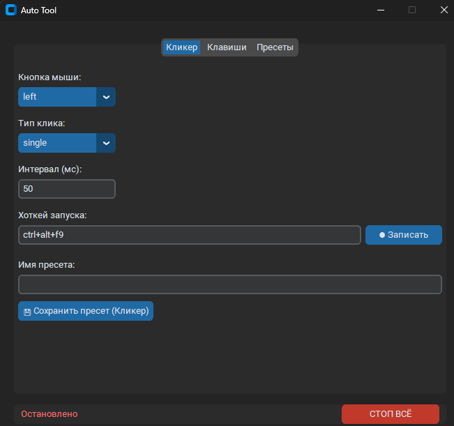

# 🤖 Auto Tool

Автоматизатор задач для Windows: автокликер, спам клавишами, клики по точкам с оверлеем. Проект создан для портфолио.


---

## 📸 Демонстрация



> Интерфейс: 4 вкладки — Клик, Клавиши, Точки, Пресеты.

---

## ⚙️ Стек технологий

- **Python 3.10+**
- **customtkinter** (GUI)
- **pynput** (эмуляция мыши)
- **keyboard** (глобальные хоткеи + эмуляция клавиш)
- **tkinter** (оверлей поверх всех окон)
- **pystray** (иконка в системном трее)
- **Pillow** (генерация иконки)
- **PyInstaller** (сборка в .exe)

---

## ✨ Возможности

- 🖱 **Автокликер** — ЛКМ / ПКМ / СКМ, одиночный / двойной
- ⌨️ **Спам клавишами** — запись комбинаций с повторами (space × 3)
- 🎯 **Клики по точкам** — записал координаты, бот кликает по ним по кругу
- 👁 **Оверлей поверх окон** — маркеры точек видны на экране, клики проходят сквозь
- 🛤 **Плавное перемещение курсора** — курсор едет к точке, а не телепортируется
- ⏱ **Гибкий интервал** — единицы **мс / сек / мин**, значение + случайный разброс `±`
- 🔁 **Счётчик выполнений** — задать количество кликов/повторов (0 = ∞)
- ⏸ **Пауза / Продолжить** — одним кликом
- 🖥 **Сворачивание в трей** — крестик скрывает окно, программа работает в фоне
- 🔥 **Хоткеи из нескольких клавиш** — `ctrl+alt+f9`, защита от ложных срабатываний
- 💾 **Пресеты** — сохранение настроек + своего хоткея в JSON
- 🎨 **Иконка приложения** + тёмный GUI
- 📦 **Сборка в .exe** — один файл, без Python на целевой машине

---

## 📋 Управление

| Клавиша | Действие |
|---------|----------|
| `ctrl+alt+f9` | Хоткей вкладки **Клик** — старт/стоп |
| `ctrl+alt+f10` | Хоткей вкладки **Клавиши** — старт/стоп |
| `ctrl+alt+f11` | Хоткей вкладки **Точки** — старт/стоп |
| `Esc` | Стоп всего: запись, клики, оверлей |
| `F12` | Выход из программы |
| Крестик | Свернуть в трей (не выход) |

Все хоткеи настраиваются через кнопку **● Записать** — жмёшь комбо, отпускаешь, готово.

---

## ⏱ Интервалы и рандомизация

Интервал задаётся **двумя значениями**:
Интервал: [500] [мс ▼] ± [100] [мс ▼]

- **Значение** — базовый интервал. Единицы: **мс / сек / мин**.
- **Разброс `±`** — случайное отклонение. `± 0` → фиксированный интервал, `± 100` → от 400 до 600 мс.

**Примеры:**

| Значение | ± | Что получится |
|----------|---|----------------|
| 500 мс | 0 | Фиксированные 500 мс |
| 500 мс | 100 мс | Случайно 400–600 мс |
| 1 сек | 300 мс | Случайно 700–1300 мс |
| 5 мин | 0 | Фиксированные 5 минут |

---

## 🖥 Системный трей

Программа живёт в **системном трее** (рядом с часами):

- **Крестик** в окне → окно скрывается, программа работает в фоне
- **Двойной клик** по иконке → развернуть окно
- **Правый клик** по иконке → меню:
  - **Развернуть** — показать окно
  - **Стоп всё** — остановить активный пресет
  - **Выход** — полностью закрыть программу

⚠️ Windows 11 часто **прячет новые иконки** в скрытую область (стрелочка ▲ рядом с часами). Чтобы закрепить иконку:
- Правый клик по панели задач → **Параметры панели задач** → **Другие значки системного трея** → Auto Tool → **Вкл**

Пресеты работают в фоне — свернул окно, клики продолжают идти.

---

## 🎯 Как работают точки

Сценарий: у тебя есть сетка из 25 клеток (например, Бинго). Тебе называют число, ты должен кликнуть по нужной клетке. С точками:

1. Записываешь **все 25 клеток** как точки
2. Ставишь интервал (например, `500 мс ± 200`) и прогоны (1)
3. Сохраняешь пресет с хоткеем
4. В нужный момент жмёшь хоткей → бот прожал все клетки по очереди

**Опции:**
- **Прогонов** — сколько раз пройти по всем точкам (1, 5, 10 или 0 = ∞)
- **Плавное перемещение** — курсор едет к точке, выглядит естественнее
- **Показывать оверлей** — видеть маркеры точек поверх окон

Работает не только для Бинго — любая задача "прожать N мест по кругу".

---

## 🚀 Как запустить локально

### Из исходников

```bash
# 1. Клонировать репозиторий
git clone https://github.com/FurtherWind/auto-tool.git

# 2. Перейти в папку проекта
cd auto-tool

# 3. Создать виртуальное окружение
python -m venv venv

# 4. Активировать (Windows)
venv\Scripts\activate

# 5. Установить зависимости
pip install -r requirements.txt

# 6. Запустить
python main.py